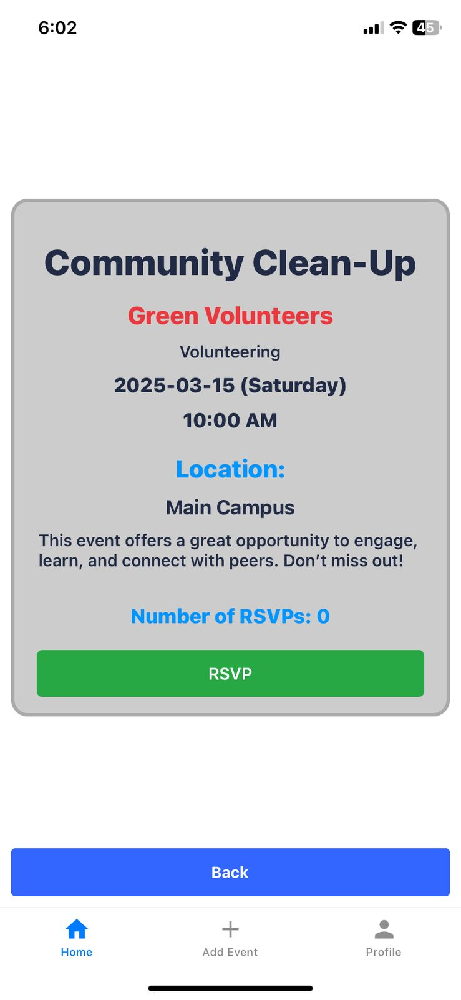

# HTU Events

__A demo app to show ongoing events at HTU__

When loading up the app you will be presented with a login page. There are 2 users. For now you can use "f" for the email and "f" for the password.
> The other user provide no additional functionality

You will then be shown all current events happening at HTU, you can tap the "View Details" button on each card to view more information or RSVP for the event.

You can also add new events by tapping the "Add Event" button on the center bottom and all the fields have to be filled out for a new event to be added.

To view your profile or log out tap the icon on the bottom right. 

# Screens
|  Log In | Event Card | Details/RSVP | 
| :-------------: | :-------------: | :-------------: |
|   |  |  | 
|  __Add Event__  | __Custom Event Card__ | __Log Out__ |
|  |  | 

## Notes
Most of the UI is done with the [UI-Kitten](https://akveo.github.io/react-native-ui-kitten/) Framework  

Unfortunately the Backend Folder is empty since I couldn't get react native to establish a connection with my express server 😢  

The images used for each card are not accurate to the event, since I didn't have their posters.
